## 1. 分类问题

根据已知样本的某些特征，判断一个新的样本属于**哪种已知的样本类。标签属于：非连续型（例如：1（通过）,0（不通过））**

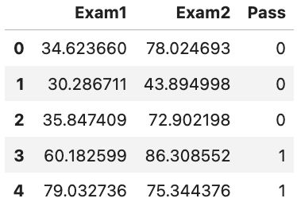

---

## 2. 解决分类问题的常用算法/方法/模型

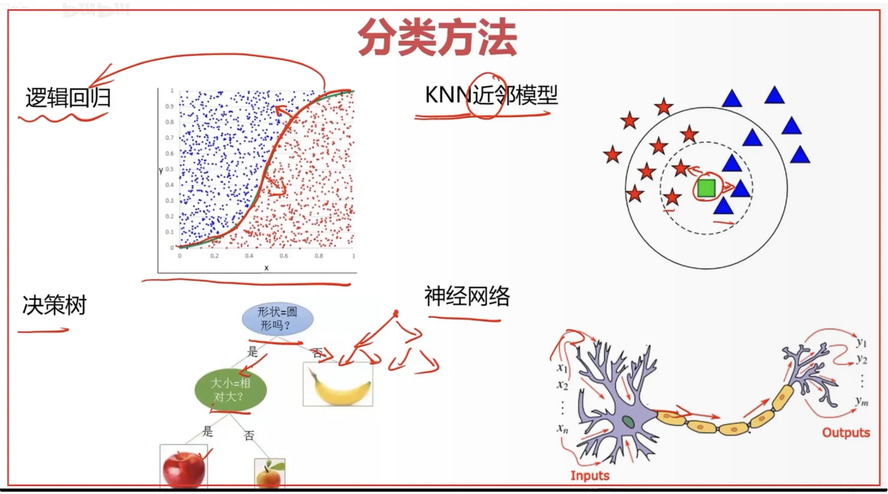

---

- 本小节主要介绍逻辑回归模型

## 3. 若用`线性回归模型`解决`分类问题`会出现的问题

> 若用线性回归模型(`y=ax+b`)解决分类问题，样本量太大时（a偏小，b偏小），会出现预测错误的情况

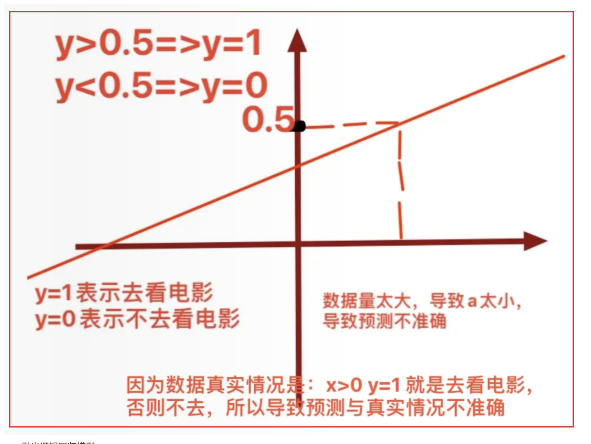

---

- 引出逻辑回归模型

## 4. 逻辑回归模型

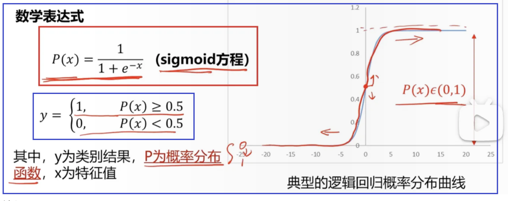

- 当分类任务变复杂。将x替换为g(x)
    
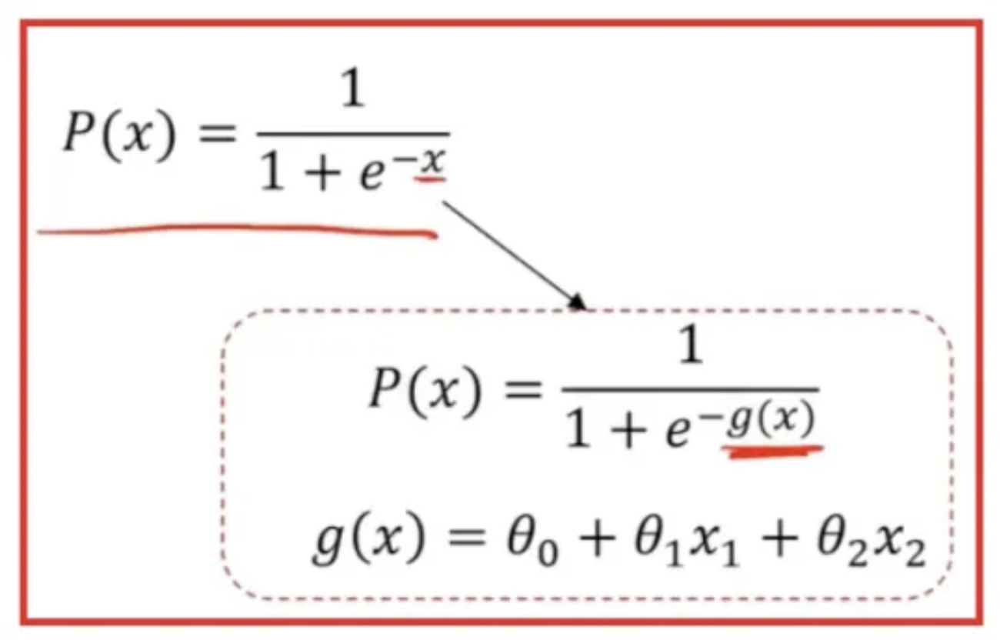
    
- 例子：
    
    `g(x)=-4+x_1+x_2` (因为这条直线就是`-4+x_1+x_2=0`)
    
    - 这条线是：`-4+x_1+x_2=0`
        - 若`-4+x_1+x_2>0`，表明在这条线的上面
        - 若`-4+x_1+x_2<0`，表明在这条线的下面
        - 刚好对应到P(x)>0.5,<0.5，也就是成功的分类了
    
    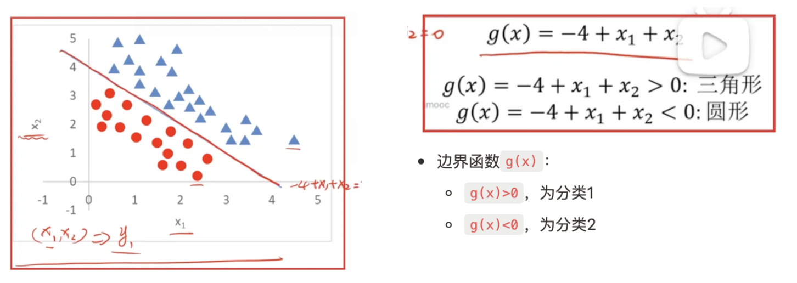
    
- 例子2：
    
  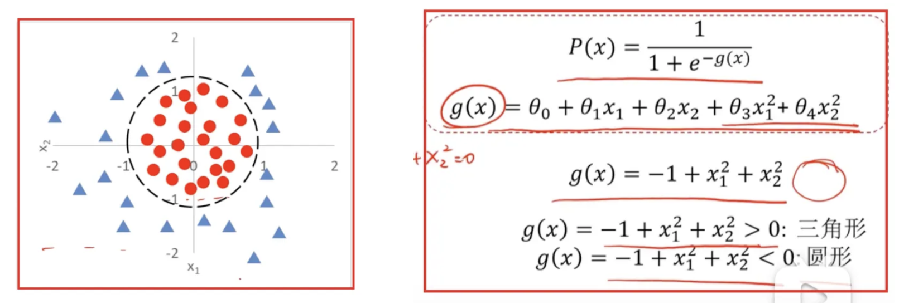
    
- 最后，求逻辑回归模型 ⇒ 也就是求g(x)
    

---

## 5. 如何求边界函数g(x)

> $g(x)=\theta_0+\theta_1x_1+\theta_2x_2...$， $x_1,x_2,...$都是数据已知的。 ⇒原问题变为：求$\theta_0,\theta_1,\theta_2...$

- 回顾线性回归模型的求解⇒求损失函数的最小值⇒梯度下降法求损失函数的最小值，得到此时的`a，b`⇒得到线性回归模型
    
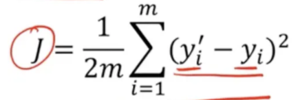
    
- 又由于 y^’，y的取值都是1，0，都是离散值。使用这个损失函数无法找到极小值点。
    
- 根据经验，新损失函数为：
    
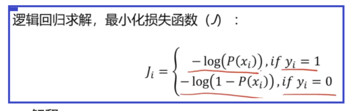
    
    - 解释：
        
        y=1时候：
        
        P(x)=1，那么J=0
        
        P(x)→0，那么J→+∞
        
        与式1函数的变化趋势相同类似
        
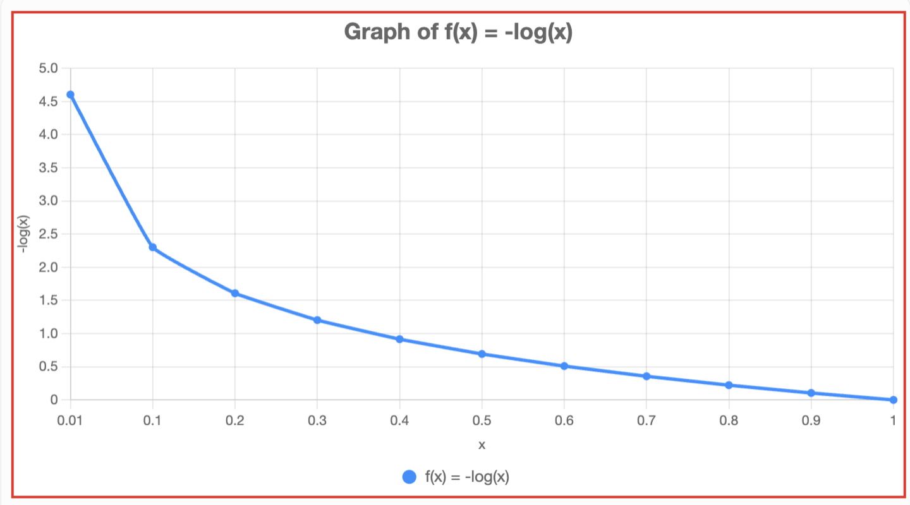
        
        y=0时候：
        
        P(x)=0，那么J=0
        
        P(x)→1，那么J→+∞
        
        与式2函数的变化趋势相同类似
        
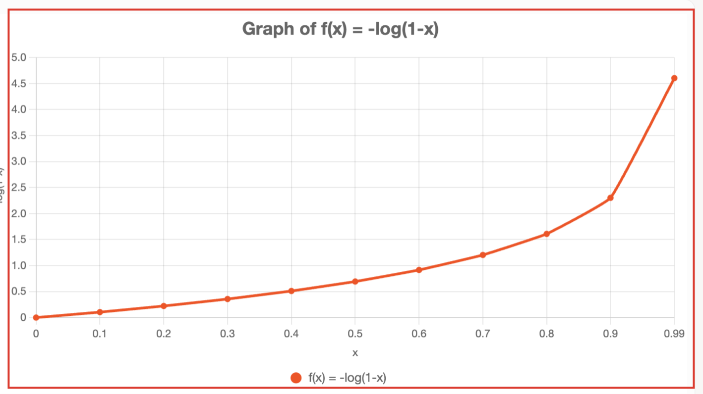
        
- 得到：`J`和`$\\theta$`的关系式，⇒想要求损失函数J的最小值⇒梯度下降法求J的最小值⇒求出此时的$\theta_0,\theta_1,\theta_2...$⇒得到逻辑回归模型
    
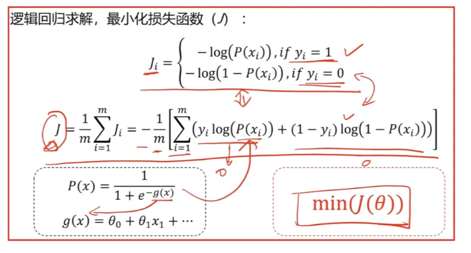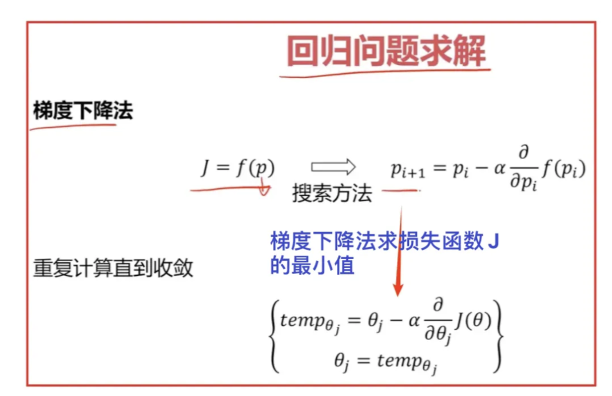